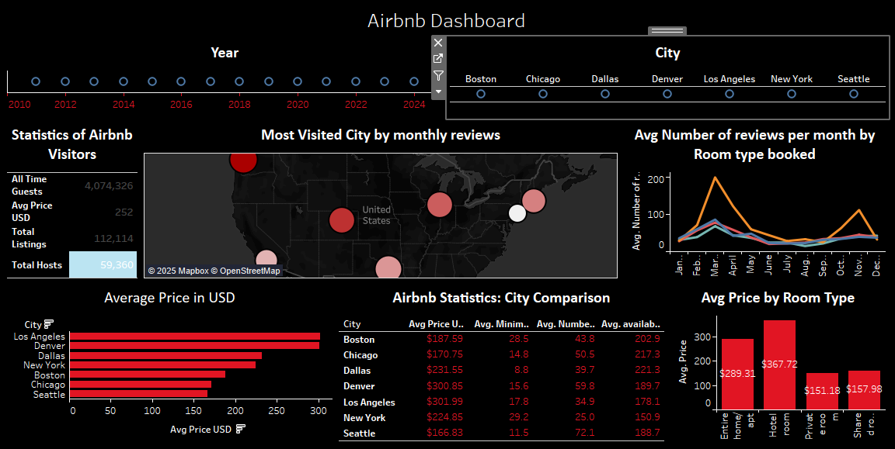

# Airbnb Listings Analysis

## Project Overview
This project analyzes Airbnb listing data to uncover trends and insights about pricing, reviews, availability, and room type preferences across various cities. This project provides actionable recommendations for travelers and hosts by leveraging data visualization and statistical analysis.

---

## Dashboard

The dashboard highlights:
- Key metrics such as pricing, reviews, and availability.
- City-specific trends for pricing and reviews.
- Room type popularity and seasonal patterns.

---

## Objectives
1. Identify pricing trends across cities and room types.
2. Understand review patterns by month and room type.
3. Analyze availability rates and their impact on city popularity.
4. Provide tailored recommendations for travelers and Airbnb hosts.

---

## Dataset Overview
The dataset includes:
- **Key Metrics**:
  - Average price per city and room type.
  - Number of reviews per month.
  - Availability rates across cities.
- **Geographic Coverage**:
  - Major cities with publicly available Airbnb data.

### Example Columns:
- `price`: Listing price in USD.
- `number_of_reviews`: Total reviews for each listing.
- `room_type`: Type of room (Entire home/apt, Private room, etc.).
- `availability_365`: Number of days a listing is available in a year.

---

## Data Analysis Highlights
### Pricing Analysis
- **Cities with Highest Prices**:
  - Denver: $230.16
  - Los Angeles: $228.13
- **Budget-Friendly Cities**:
  - Chicago: $150.18
  - Seattle: $151.98

### Review Patterns
- Seasonal peaks observed in March.
- Private rooms and shared rooms show consistent popularity.

### Availability Trends
- High availability correlates with increased reviews and city popularity.
- Room type influences availability rates.

---

## Visualizations
1. **Average Price by City**:
   - Bar chart showcasing price variations.
2. **Room Type Distribution**:
   - Comparison of average prices for different room types.
3. **Seasonal Review Trends**:
   - Line graph illustrating monthly review patterns.

---

## Recommendations
1. **For Travelers**:
   - Opt for **Chicago** or **Seattle** for budget-friendly stays.
   - Plan trips in **January** or **February** to avoid seasonal price hikes.
2. **For Hosts**:
   - Enhance amenities in **Entire Home/Apt** listings to attract high-end travelers.
   - Focus on optimizing listing availability during peak review months like March.

---

## Key Insights
- **Most Visited Cities**:
  - Denver, Los Angeles, and Chicago lead in review counts.
- **Room Type Preferences**:
  - Entire homes and hotel rooms are pricier but preferred by luxury travelers.
  - Private and shared rooms cater to budget-conscious tourists.
- **Seasonal Demand**:
  - March is the peak month for reviews, suggesting higher bookings.

---

## Technologies Used
- **Tools**: Excel, Tableau
- **Visualizations**:
  - Bar charts, line graphs, and maps.
  - Interactive dashboard summarizing key metrics.

---

## Team Members
- Khushi Doshi  
- Hemant Kailash Agrawal  
- Krutika Patel  
- Savan Patel  
- Yash Tailor  
- Dhrumil Prajapati  

---

## How to Access the Dashboard
1. Open the `Dashboard_Image.png` file to view the key visualizations.
2. Explore the interactive dashboard in Tableau.

---

## References
1. Public Airbnb Dataset Sources.
2. Data preparation and cleaning methods.

---

